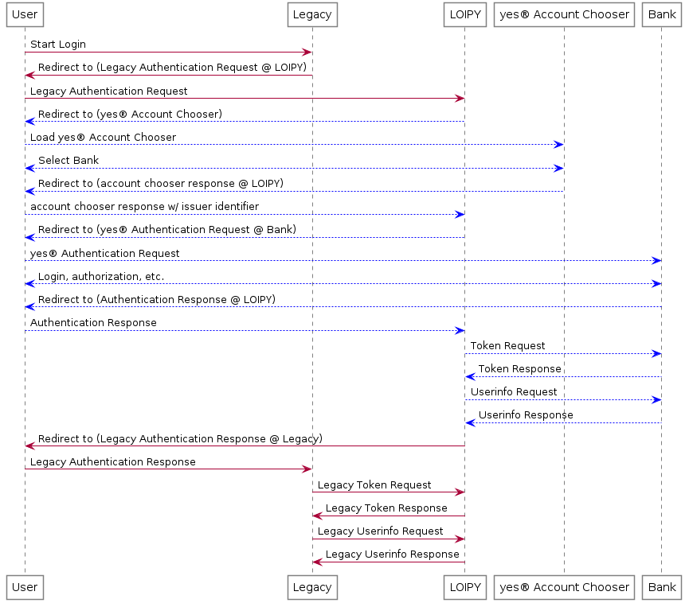

# LOIPY: Legacy OpenID Connect Integration Proxy for yes®

LOIPY is an OpenID Connect (OIDC) Identity Provider (IDP) proxy which translates "traditional" OpenID Connect requests into requests to the yes® ecosystem, including the bank/account chooser interface.

LOIPY enables relying parties to use the yes® ecosystem if they are lacking support for features needed by yes®, for example, [MTLS for Client Authentication](https://tools.ietf.org/html/rfc8705) or dynamic configuration of issuer URIs.

**IMPORTANT:** This server is designed to be operated under the control and within the network of a yes® relying party. It is not designed to be made available to arbitrary relying parties over the web. 

**What does this do?**

This software acts as an OpenID Connect IDP to some legacy service and as a yes®-compatible Relying Party to the banks connected to the yes® ecosystem. The following figure shows how LOIPY translates requests from a Legacy service to yes®. Note that the red arrows indicate "classic" OIDC requests and responses. Blue arrows indicate requests and responses according to the yes® specifications and security guidelines.


(Some background calls have been omitted for brevity.)

**User Data Handling**

LOIPY requests user data from the userinfo endpoint of the selected bank and makes it available in the ID token and/or userinfo endpoint for the legacy system. To ensure uniqueness of the user identifiers, the `sub` value presented to the legacy system is a JSON-encoded list containing the user's `sub` value at the bank plus the `iss` (issuer identifier) of the bank.  This value is guaranteed to be unique in the yes® ecosystem and is a stable identifier for the user's account.

The following shows all user data acquired by a legacy system at the userinfo endpoint of LOIPY (line breaks for display purposes only):

```json
{
  "https://www.yes.com/claims/preferred_iban":"DE87123456781234567890",
  "sub":"[\"8b9f9588-4ad1-4069-9c66-7231f79d41c0\", \"https://testidp.sandbox.yes.com/issuer/10000002\"]",
  "verified_claims":{
    "claims":{
      "birthdate":"1996-08-30",
      "family_name":"Gottschalk",
      "given_name":"Peter"
    },
    "verification":{
      "trust_framework":"de_aml"
    }
  }
}
```

All claims supported by yes® can be retrieved through LOIPY. Please consult the [yes® Developer Guide, Sections User Information and Verified Claims](https://yes.com/docs/rp-devguide/latestversion/IDENTITY/#user_information) to learn which claims can be requested. 

To control which claims are retrieved for a particular request, the legacy system can use the `scope` parameter. A mapping in the LOIPY configuration file defines which claims are retrieved when a specific `scope` parameter is used.

For example, the data shown above was retrieved for a legacy OIDC authentication request containing `...&scope=openid%20testscope&...`, i.e., the two scopes `openid` and `testscope`. The `openid` scope is only used to designate an OIDC flow and cannot be mapped. The `testscope` scope was mapped in the LOIPY configuration as follows:

```YAML
scope_to_claims_mapping:
  testscope: {
    "https://www.yes.com/claims/preferred_iban":"None",
    "verified_claims":{
        "claims":{
        "birthdate":"None",
        "family_name":"None",
        "given_name":"None"
        },
        "verification":{
        "trust_framework":"de_aml"
        }
    }
    }
```
(Note: JSON is a subset of YAML syntax. [configuration.example.yml](./configuration.example.yml) shows the same mapping in pure-YAML syntax.)

Only the first non-`openid` scope is evaluated for the mapping. Everything within `testscope:` is used by LOIPY as the contents of the `userinfo` part of the claims parameter that is sent to the bank. 

In the same manner, scopes are used to control whether LOIPY requests from the bank's IDP that the user has to use her online banking second factor (SCA, Strong Customer Authentication):

```YAML
scope_to_sca_mapping:
  testscope: yes
  other_scope: no
```

A true-ish value means that the `acr` value of `https://www.yes.com/acrs/online_banking_sca` is requested, otherwise `https://www.yes.com/acrs/online_banking`. See the yes® Developer Guide for details.

**Prerequisites**
 - Python > 3.6
 - The server requires a redis instance to cache user data.
 - The server requires a key pair to sign ID tokens with (even if you don't need ID tokens). Create a key pair (and matching self-signed certificate) with `openssl req -x509 -newkey rsa:4096 -keyout key.pem -out cert.pem -days 10096 -subj '/CN=LOIPY' -nodes`

**Configuration**

Please read the notes in [configuration.example.yml](./configuration.example.yml) carefully and modify the file accordingly. When done, rename the file to `configuration.yml` (will be searched in the working directory) or set the environment variable `LOIPY_CONFIG_FILE` to point to the configuration file.

**Running**

The application server is based on flask and therefore can be run with any wsgi-compliant web server, e.g., gunicorn. For development, the standalone flask server can be used:
```bash
FLASK_APP=loipy.wsgi flask run -p 3000
```

**Docker**

A [Dockerfile](./docker/Dockerfile) is provided to build a docker image:
```bash
cd docker
docker build -t loipy .
```
To run the docker container:
 - Make sure that a redis server is running, e.g. using `docker run redis`.
 - Make sure that the redis URL in the configuration file points to this 
   docker server, e.g., using the host's docker0 IP: `redis://172.17.0.1:6379/0`
 - Put the signing key (as above) and the configuration file in `./data`
 - Put the yes client keys into `./data/yes-client/` and configure the `redirect_uri` and `client_id` to match the values registered with yes®.
```
docker run -e LOIPY_CONFIG_FILE=/data/configuration.yml -v `pwd`/data:/data loipy
```
